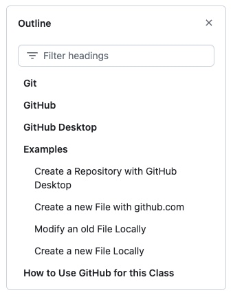

# Matlab Programming Class
Welcome to Week1 of CE640 / OC512. Before we get started, please ensure that you have looked at the main [readme](../../README.md) file. That file contains some basic information about how to access Matlab, Slack, and Github. Next, please ensure that you have looked at the [syllabus](../../syllabus.md) for this class. The syllabus has a lot of basic information, such as my contact information (and location), class policies, and other items.

## Markdown
Before we go too far, though, what is up with these files that we are looking at? The .md file extension? These are called markdown files. I don't want to dwell too much on them, but they are a nice way of creating attractive and well-organized documents. You can create hyperlinks and other things. One thing that may be useful for you to know is that markdown files can have nice tables of contents. To access this, look at the upper right of this window and you will see this:

If you click on the three bars in the upper right, you will open up the handy table of contents for the given .md file that you are looking at. Here is just an example:

Clicking on the x in the upper right will close the table of contents.

## GitHub Introduction
Ok, great. Well, if you are reading this file, you already know a bit about GitHub. Why are we here? Great question, let's go to this [introduction](github_intro.md) and learn about it.

## Matlab Introduction
Ok, well, our remaining task today is to learn a bit about the Matlab environment. So, head on over [here](matlab_overview.md) and let us do that!
