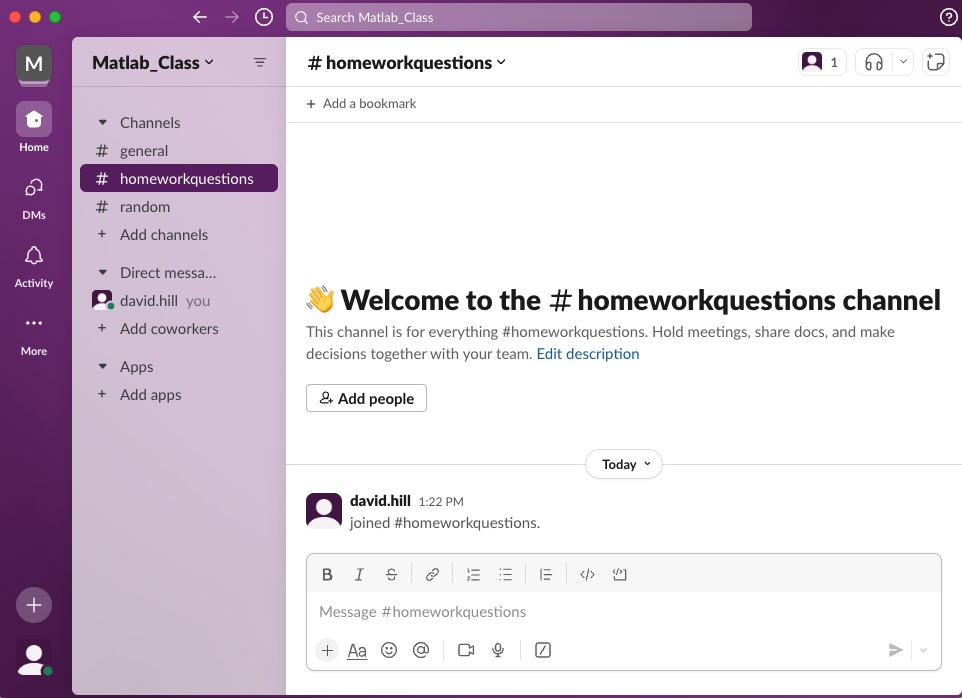

# Slack
So, there are tons of resources online in terms of learning the basics of Slack. Why use this and not Canvas? Because it is much nicer for creating threads regarding, for example, questions on homework. I would like to HIGHLY encourage you to use Slack discussions for homework help. Absolutely come see me during office hours, but Slack is nice since I can respond quickly, and you all can help to answer each others question. So, you will see something like this:

