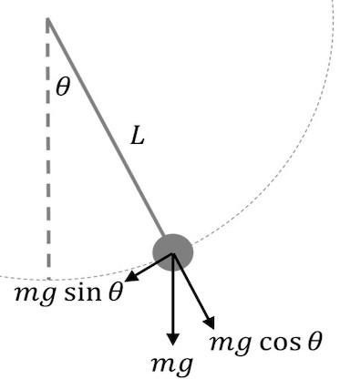

# In-Class Example 1

Below is a sketch of a pendulumn. This is a classic problem in physics where the pendulumn oscillates back and forth, constantly trading potential energy for kinetic energy and vice versa.

The equation that describes this motion is 

$$\frac{d^{2}\theta}{dt^{2}}+\frac{g}{L}\sin(\theta)=0$$

where g is gravity (9.81 $m^2 s^-^1$) and L is the pendulumn length in m.
