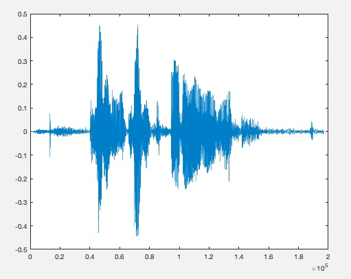

## In-Class Example 2
Ok, let's try something fun. First, I want you to use your phone to make an audio recording. You can sing, you can say a single sentence. Whatever. Make it at least 5 seconds long. How do you do this?
1. If you have an iPhone, use the 'voice memos' app.
2. After stopping the recording, touch the circle at right with the three dots. 
3. Touch the 'share' option and you can email it to yourself. If you are working on your own laptop, you can airdrop it. It should be an .m4a file.
4. If you are an Android user, I have no idea, sorry.  :)
5. If this does not work for you, no worries, you can use the supplied .m4a file in the class notes for this week.

Next, try to load the recording into Matlab. You can do this with something like
```
[y,fs]=audioread('recording.m4a');
```
y will be a vector containing the data (try to plot it!) and fs will tell you the sampling frequency (in Hz, or cycles per second...it should be a very high number). Your plot will look something like


x
